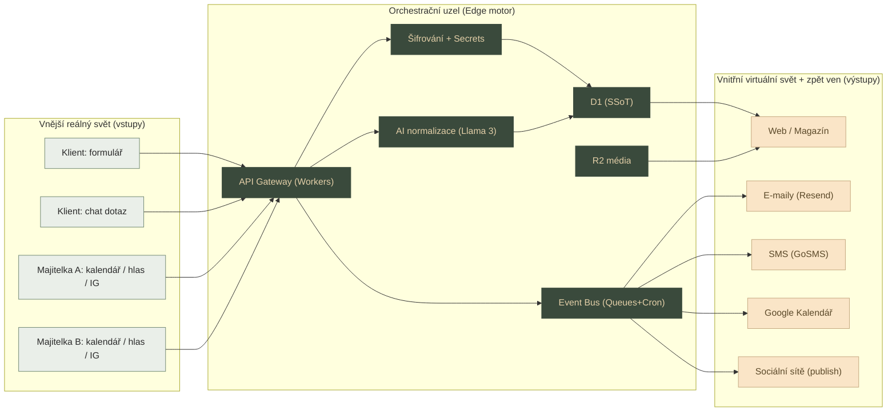

# 01 · Architektura ekosystému (end-to-end)

> Tento dokument popisuje, jak spolu jednotlivé vrstvy fungují — od zařízení klienta až po databázi a integrace. Je nadřazený souborům 02 (DB), 03 (Workers/mapy) a 04 (UX/metadata).

## 1. Filozofie: „Cloudflare-first" uvnitř MEVERIK STUDIO

Produkční web Bicom Písek je **úzká, levná, předatelná** výseč širší distribuované architektury MEVERIK STUDIO. Pravidlo: v produkci klientky běží jen to, co je zdarma/levné a snadno předatelné; veškeré komplexní know-how (Vue/Nuxt verze, FastAPI enginy, AI orchestrace) zůstává ve vývojovém repu MEVERIK.

```
                         MEVERIK STUDIO — distribuovaná architektura
   ┌──────────────────────────────────────────────────────────────────────┐
   │  PRIMÁRNÍ STACK              ZÁLOŽNÍ / ROZŠÍŘENÍ                        │
   │  Frontend:  Vue.js+Nuxt+TS    →  Next.js+TS+Tailwind                    │
   │  Mobil:     Flutter / Swift                                            │
   │  Compute:   CF Workers        →  FastAPI / Cloud Run                    │
   │  Async:     CF Queues                                                  │
   │  AI:        CF Workers AI     →  GCP AI Garden / NVIDIA NIM (Llama 3)   │
   │  DB:        CF D1             →  Neon.tech (Postgres)                   │
   │  Storage:   CF R2             →  (3Q2026+ vlastní úložiště)             │
   │  Cache:     CF KV             →  Upstash (Redis)                        │
   │  Platby:    Apple/Google Pay  →  Stripe ·  Účto: Fakturoid/iDoklad API  │
   │  Auth:      Firebase Auth (Apple/Google)                              │
   │  DevOps:    ANTIGRAVITY (Gemini Flash · Claude Opus/Sonnet · Copilot)  │
   │  CI/CD:     GitHub Pro/Actions ·  QA: Sentry · k6/Locust               │
   └──────────────────────────────────────────────────────────────────────┘
                                    │
                  ┌─────────────────┴─────────────────┐
                  │   PRODUKČNÍ VÝSEČ — BICOM PÍSEK    │
                  │  (Edge-First, Zero-Cost, předatelná)│
                  └───────────────────────────────────┘
```

## 2. Vrstvy produkčního webu (Cloudflare Edge Grid)

| # | Vrstva | Technologie | Funkce | Cíl výkonu |
|---|--------|-------------|--------|-----------|
| 0 | Hrana sítě | Cloudflare DNS + WAF | DDoS štít, rate limiting (100 req/min/IP), bot management | TLS 1.3 |
| 1 | Frontend | CF Pages — HTML5 + Tailwind + Vanilla ES6 (SPA router) | Prémiový portál „Quiet Luxury", fluidní bez přeblikávání | TTFB < 50 ms, LCP < 500 ms |
| 2 | Logika | CF Workers (V8 isolates, ES modules) | API `/api/book`, `/api/newsletter`, `/api/chat`, `/api/admin/copywriter` | bez Node.js závislostí |
| 3 | AI | CF Workers AI (`@cf/meta/llama-3-8b-instruct`) | Chatbot „AI Rádce" + admin copywriter (audio→blog) | edge inference |
| 4 | Data | CF D1 (distribuovaná SQLite) | `bookings`, `newsletter_subscribers`, `blog_posts`, `geo_leads`, `audit_log` | field-level AES-GCM |
| 5 | Storage | CF R2 (S3-kompatibilní) | videa, fotogalerie, certifikáty — bez egress poplatků | — |
| 6 | Cache/Stav | CF KV | session tokeny, rate-limit čítače, cache JSON-LD | — |
| 7 | Integrace | Google Calendar/Gmail, Resend, Meta Graph, SMS brána | viz `03_Workers_automatizace_mapy.md` | OAuth2 / Service Account |

## 3. Hlavní datové toky (sekvence)

### Tok A — Rezervace (klient → ordinace)
```
Klient (formulář)
  → POST /api/book (Worker)
     → validace + sanitizace (XSS, SQLi)
     → DataCrypt.encrypt(citlivé pole)        [AES-GCM, klíč z CF Secrets]
     → INSERT do D1 (bookings, status=pending)
     → Google Calendar API: vlož „předběžnou" událost (žlutá) do kalendáře Lenky
     → Resend API: transakční e-mail s instrukcemi (24h nepít kávu, pít vodu)
     → zapsat do audit_log
  → klientovi: stránka poděkování
```

### Tok B — Potvrzení termínu (Lenka → klient)
```
Lenka v Google Kalendáři změní barvu události na zelenou (potvrzeno)
  → Google Calendar webhook → Worker /api/calendar-hook
     → UPDATE D1 bookings.status = 'confirmed'
     → Resend: potvrzovací e-mail
     → naplánovat SMS upomínku (zápis do KV/queue, T-24h)
```

### Tok C — Bezúdržbový blog (Instagram → web)
```
Cron (každých 24 h) → Worker sync-instagram
  → Meta Graph API: zjisti nové příspěvky
  → stáhni obrázek → R2 (gallery/)
  → text → D1 blog_posts (source='instagram')
  → web v sekci Magazín se sám aktualizuje
```

### Tok D — AI copywriter (hlas → článek)
```
Lenka namluví poznámku → přepis (klávesnice iPhone) → vloží do admin
  → POST /api/admin/copywriter (Worker, ověřený admin token)
     → Workers AI (Llama 3): surový text → „Quiet Luxury" článek + titulek + meta + JSON-LD
     → návrh ke schválení → na klik publikuj do D1 blog_posts
```

## 4. Bezpečnostní principy (shrnutí, detail v 02 a 05)

- **Field-level encryption** citlivých zdravotních polí (čl. 9 GDPR) — AES-GCM 256, Web Crypto API, klíč jen v CF Secrets.
- **Žádný tajný klíč v repu** — vše v CF Secrets, lokálně v `.dev.vars` (v `.gitignore`).
- **Data minimization** — osobní + zdravotní data se po 30 dnech od návštěvy anonymizují (Cron).
- **Cookie consent gating** — měřicí kódy (GA4/Meta Pixel přes GTM) se spustí až po souhlasu.
- **Audit log** — každý zápis citlivých dat se loguje (kdo/kdy/co, bez plaintextu hodnot).

## 5. Prostředí a deploy

| Prostředí | Hosting | DB | Účel |
|-----------|---------|----|------|
| `local` | `wrangler pages dev` | D1 `--local` | vývoj |
| `preview` | CF Pages preview (per PR) | D1 dev | review PR |
| `production` | CF Pages (`bicompisek.cz`) | D1 `bicom-db-prod` | ostrý provoz |

Deploy: GitHub Actions → `wrangler pages deploy` (Continuous Deployment z větve `main` produkčního repa).

## 6. Co je „nadřazené" a co „předatelné"

- **Předatelné klientce:** repo `bicom-repozit-produkce` (čistý produkční kód), CF účet, D1, R2, Workers, Google Workspace, doména. Popsáno v `05_HANDOVER`.
- **Zůstává v MEVERIK:** soukromý repo s experimentálními funkcemi, univerzální knihovny, komplexní AI orchestrace, Vue/Nuxt varianta, FastAPI enginy.


# 02 · Databáze D1 — logika, schéma a jak ji udržet „živou"

> Cloudflare D1 = distribuovaná SQLite na okraji sítě. Veškerá logika a schéma jsou v kódu (hardcode v `db/schema.sql` + migrace), což dává absolutní kontrolu a eliminuje těžkopádný CMS.

## 1. Rozšířené schéma (oproti iniciační verzi)

Iniciační verze měla 3 tabulky (`bookings`, `newsletter_subscribers`, `blog_posts`). Pro „živou" DB, GEO a GDPR přidáváme `geo_leads`, `audit_log`, `services`, `reminders`.

```sql
-- bookings: rezervace (čl. 9 GDPR — citlivá pole šifrována na úrovni aplikace)
CREATE TABLE bookings (
  id              TEXT PRIMARY KEY,            -- UUID v4
  name_enc        TEXT NOT NULL,               -- AES-GCM (Base64: IV+cipher)
  email_enc       TEXT NOT NULL,               -- AES-GCM
  phone_enc       TEXT NOT NULL,               -- AES-GCM
  service         TEXT NOT NULL,               -- slug služby (ne plaintext zdrav. údaj)
  note_enc        TEXT,                        -- volný popis potíží = nejcitlivější, vždy šifrovat
  preferred_date  TEXT NOT NULL,
  psc             TEXT,                        -- PSČ pro GEO analytiku (ne-citlivé)
  status          TEXT DEFAULT 'pending',      -- pending|confirmed|done|cancelled
  consent_version TEXT,                        -- verze odsouhlaseného souhlasu
  created_at      TIMESTAMP DEFAULT CURRENT_TIMESTAMP,
  anonymized_at   TIMESTAMP                    -- vyplní Cron po 30 dnech
);
CREATE INDEX idx_bookings_status ON bookings(status);
CREATE INDEX idx_bookings_created ON bookings(created_at);

CREATE TABLE newsletter_subscribers (
  id          TEXT PRIMARY KEY,
  email_enc   TEXT NOT NULL,                   -- šifrováno
  email_hash  TEXT NOT NULL UNIQUE,            -- SHA-256(email) pro deduplikaci bez plaintextu
  status      TEXT DEFAULT 'active',           -- active|unsubscribed
  created_at  TIMESTAMP DEFAULT CURRENT_TIMESTAMP
);

CREATE TABLE blog_posts (
  id          TEXT PRIMARY KEY,
  slug        TEXT UNIQUE NOT NULL,            -- pro SEO URL /magazin/{slug}
  title       TEXT NOT NULL,
  excerpt     TEXT,                            -- meta description / náhled
  content     TEXT NOT NULL,                   -- markdown/HTML
  image_url   TEXT,                            -- R2 URL
  jsonld      TEXT,                            -- předgenerované Article schema
  source      TEXT DEFAULT 'instagram',        -- instagram|ai_copywriter|manual
  status      TEXT DEFAULT 'draft',            -- draft|published
  published_at TIMESTAMP,
  created_at  TIMESTAMP DEFAULT CURRENT_TIMESTAMP
);
CREATE INDEX idx_blog_status ON blog_posts(status, published_at);

-- services: katalog služeb (řídí frontend, ceny, JSON-LD) — drží web „živý" bez CMS
CREATE TABLE services (
  slug         TEXT PRIMARY KEY,               -- napr. 'odvykani-koureni'
  name         TEXT NOT NULL,
  segment      TEXT,                           -- zeny|deti|profesionalove|biohackeri
  short_desc   TEXT,
  long_desc    TEXT,
  price_from   INTEGER,                        -- transparentní ceník (CZK)
  sessions_typ TEXT,                           -- napr. '3–5 sezení'
  jsonld       TEXT,                           -- MedicalProcedure/Service schema
  active       INTEGER DEFAULT 1,
  updated_at   TIMESTAMP DEFAULT CURRENT_TIMESTAMP
);

-- geo_leads: anonymní lokální signály (z jakého PSČ chodí poptávky) → GEO kampaně
CREATE TABLE geo_leads (
  id          TEXT PRIMARY KEY,
  psc         TEXT,
  city        TEXT,                            -- odvozeno z PSČ
  service     TEXT,
  source      TEXT,                            -- organic|ads|ai_referral|maps
  created_at  TIMESTAMP DEFAULT CURRENT_TIMESTAMP
);
CREATE INDEX idx_geo_city ON geo_leads(city, created_at);

-- reminders: fronta SMS/e-mail upomínek (T-24h)
CREATE TABLE reminders (
  id          TEXT PRIMARY KEY,
  booking_id  TEXT NOT NULL,
  channel     TEXT NOT NULL,                   -- sms|email
  send_at     TIMESTAMP NOT NULL,
  sent        INTEGER DEFAULT 0,
  FOREIGN KEY (booking_id) REFERENCES bookings(id)
);
CREATE INDEX idx_reminders_due ON reminders(sent, send_at);

-- audit_log: GDPR auditní stopa (bez plaintextu hodnot)
CREATE TABLE audit_log (
  id          TEXT PRIMARY KEY,
  entity      TEXT NOT NULL,                   -- bookings|blog_posts|...
  entity_id   TEXT,
  action      TEXT NOT NULL,                   -- create|update|anonymize|export|delete
  actor       TEXT,                            -- system|admin|cron
  created_at  TIMESTAMP DEFAULT CURRENT_TIMESTAMP
);
```

## 2. Field-level šifrování (čl. 9 GDPR)

Třídu `DataCrypt` (Web Crypto API, AES-GCM 256) naprogramuje agent dle promptu v `04_AGENTI`. Pravidla:
- Šifrují se: `name_enc`, `email_enc`, `phone_enc`, `note_enc` (bookings), `email_enc` (newsletter).
- **Nešifruje se:** `service`, `psc`, `status`, `slug`, obsah blogu (veřejný) — aby šly dělat GEO statistiky a dotazy.
- Klíč `ENCRYPTION_KEY` žije **jen** v CF Secrets; v repu nikdy.
- Pro deduplikaci e-mailů se ukládá i `email_hash = SHA-256(lowercase(email))`.

## 3. Jak udržet databázi „živou" (data lifecycle)

„Živá DB" = data, která se sama plní, čistí a přináší hodnotu, bez ruční údržby.

| Mechanismus | Jak | Frekvence |
|-------------|-----|-----------|
| **Auto-plnění obsahu** | Cron sync z Instagramu → `blog_posts` | 24 h |
| **AI obohacení** | Copywriter generuje `jsonld`, `excerpt`, `slug` při publikaci | on-demand |
| **GEO signály** | každá poptávka zapíše anonymní `geo_leads` (PSČ→město) | real-time |
| **Anonymizace** | Cron přepíše `*_enc` na NULL + nastaví `anonymized_at` 30 dní po `preferred_date` | denně |
| **Dedup newsletteru** | `email_hash UNIQUE` brání duplicitám | při zápisu |
| **Zdravotní integrita** | `PRAGMA foreign_keys=ON`, indexy na hot-path dotazech | trvale |
| **Konzistence katalogu** | `services` je jediný zdroj pravdy pro ceny i JSON-LD na webu | při změně |

### „Self-healing" a chytrá doporučení
Worker `geo-insights` (Cron týdně) agreguje `geo_leads` a do admin rozhraní zapíše doporučení typu: *„Nárůst poptávek z Vodňan (8× za 30 dní) — zvaž lokální kampaň na odvykání kouření."* Tím se DB stává aktivním marketingovým nástrojem, ne pasivním úložištěm.

## 4. Migrace a verzování

```
db/
├── schema.sql              # kompletní aktuální schéma (idempotentní CREATE IF NOT EXISTS)
├── migrations/
│   ├── 0001_init.sql
│   ├── 0002_geo_leads.sql
│   ├── 0003_services_audit.sql
│   └── ...                  # každá změna = nová číslovaná migrace, NIKDY neupravovat starou
└── seed/
    ├── services.sql         # počáteční katalog služeb
    └── dev_sample.sql       # testovací data (jen local)
```

Příkazy:
```bash
# init lokálně i na produkci
npx wrangler d1 execute DB --local  --file=db/schema.sql
npx wrangler d1 execute bicom-db-prod --remote --file=db/schema.sql
# migrace
npx wrangler d1 migrations apply bicom-db-prod --remote
```

## 5. Zálohy a obnova
- Týdenní export D1 → R2 (`backups/` bucket) přes Cron Worker (`d1 dump`).
- Retence 8 týdnů; starší se přepisují.
- Záložní DB engine (mimo CF): **Neon.tech** (Postgres) — drží MEVERIK pro případ migrace mimo Cloudflare; schéma se udržuje kompatibilní (TEXT/TIMESTAMP).


# 03 · Workers, automatizace, Cron/Queues a mapy (NAP)

> Backend = sada izolovaných Cloudflare Workers (V8, ES modules, bez Node.js). Asynchronní úlohy řeší Cron Triggers + Cloudflare Queues. Tento dokument definuje endpointy, plánované úlohy a kompletní mapovou/lokální vrstvu.

## 1. API endpointy (Workers)

| Route | Metoda | Funkce | Externí volání |
|-------|--------|--------|----------------|
| `/api/book` | POST | Příjem rezervace → D1 + kalendář + e-mail | Google Calendar, Resend |
| `/api/newsletter` | POST | Zápis odběratele (dedup hash) | — |
| `/api/chat` | POST | AI Rádce (Llama 3, kontext z FAQ + services) | Workers AI |
| `/api/admin/copywriter` | POST | Hlas/text → článek (admin token) | Workers AI |
| `/api/calendar-hook` | POST | Webhook potvrzení termínu | Google Calendar |
| `/api/services` | GET | Katalog služeb (cache z KV) | — |

Společné principy každého Workeru:
- CORS hlavičky, validace vstupu, sanitizace (XSS/SQLi), rate limit (KV čítač).
- **Exponenciální backoff** pro externí API (Google, Resend, Meta, SMS) — 3 pokusy, 1s/2s/4s.
- Chyby → `audit_log` + Sentry; klientovi nikdy neúniká interní detail.
- Idempotence: opakovaný `/api/book` se stejným payloadem v 60s okně se zahodí (KV lock).

## 2. Plánované úlohy (Cron Triggers)

Definováno ve `wrangler.toml` v sekci `[triggers]`.

| Cron | Worker | Úloha |
|------|--------|-------|
| `0 */1 * * *` | `reminders-dispatch` | Projdi `reminders` se `send_at <= now AND sent=0` → odešli SMS/e-mail |
| `0 3 * * *` | `instagram-sync` | Stáhni nové IG příspěvky → R2 + D1 `blog_posts` |
| `30 3 * * *` | `gdpr-anonymize` | Anonymizuj `bookings` 30+ dní po `preferred_date` |
| `0 4 * * 1` | `geo-insights` | Týdenní agregace `geo_leads` → admin doporučení |
| `0 2 * * 0` | `d1-backup` | Export D1 → R2 `backups/` |

## 3. Cloudflare Queues (async úlohy)

Pro úlohy, které nesmí blokovat odpověď klientovi (např. odeslání e-mailu, zápis do kalendáře):
```
/api/book (producer) ──enqueue──▶  Queue "booking-jobs"  ──▶ consumer Worker
                                                              ├─ Google Calendar insert
                                                              ├─ Resend e-mail
                                                              └─ naplánuj reminder (D1)
```
Výhoda: klient dostane okamžité „děkujeme" (< 200 ms), těžká integrace běží na pozadí s retry.

## 4. Integrace (konektory) a jejich Secrets

| Konektor | Účel | Secret | Auth |
|----------|------|--------|------|
| Google Calendar API | zápis/čtení termínů | `GOOGLE_CALENDAR_CLIENT_EMAIL`, `GOOGLE_CALENDAR_PRIVATE_KEY` | Service Account (OAuth2) |
| Gmail / Resend | transakční e-maily | `RESEND_API_KEY` | API key |
| Meta Graph API | sync Instagramu | `META_GRAPH_ACCESS_TOKEN` | Long-lived token |
| SMS brána | upomínky 24h | `SMS_GATEWAY_API_KEY` | API key (GoSMS / sms.sluzba.cz) |
| (šifrování) | field-level | `ENCRYPTION_KEY` | generovaný hash |
| Stripe (volitelné) | online platby záloh | `STRIPE_SECRET_KEY` | API key |

> Detailní postup zřízení každého účtu + jak získat klíč: `05_HANDOVER/02_Co_zajistit_API_ucty_klice.md`.

## 5. MAPY a lokální vrstva (kritické pro GEO)

Lokální dohledatelnost stojí na třech věcech: NAP konzistenci, mapových profilech a strukturovaných geo-datech.

### 5.1 NAP konzistence (Name–Address–Phone)
**Pravidlo:** identický řetězec N/A/P na všech platformách, znak po znaku.
```
Name:    Bicom Písek – Lenka Limpouchová
Address: [přesná ulice č.p.], 397 01 Písek, Česká republika
Phone:   +420 XXX XXX XXX   (vždy mezinárodní formát)
```
Profily k založení a sladění:
- **Google Business Profile** (Google Mapy) — primární.
- **Apple Business Connect** (Apple Mapy / Siri) — důležité pro iOS publikum.
- **Firmy.cz / Mapy.cz (Seznam)** — silné v ČR.
- **Bing Places** — pro Copilot/Bing.

### 5.2 Mapa na webu
- Embed **Mapy.cz** (Seznam) jako primární (lokální relevance) + odkaz „Navigovat" do Google/Apple Map.
- Strukturovaná data `LocalBusiness` s `geo` (latitude/longitude) a `areaServed` (Písek, Strakonice, Milevsko, Vodňany, Protivín, Blatná) — viz `03_GEO_AEO/02_JSON-LD_sablony.md`.
- Sekce „Dojezdnost" s reálnými časy ze spádových měst (Strakonice 20 min, Milevsko 25 min…) — text i `areaServed`.

### 5.3 Spádová oblast (areaServed)
| Město | Vzdálenost | Pozn. |
|-------|-----------|-------|
| Písek | 0 | centrum (~30 000 ob.) |
| Strakonice | 20 km | silná synergie (~22 000) |
| Milevsko | 28 km | spádová (~8 000) |
| Vodňany | 22 km | průmyslově-zem. (~7 000) |
| Protivín | 14 km | (~5 000) |
| Blatná | 25 km | (~6 500) |

Celkem ~100–120 tis. obyvatel v dojezdu do 25 minut.

### 5.4 PSČ → město (pro geo_leads)
Worker při poptávce mapuje PSČ na město (statická lookup tabulka v KV) a zapisuje do `geo_leads`. Z toho `geo-insights` generuje lokální doporučení.

## 6. Monitoring a spolehlivost
- **Sentry** — error log z Workerů i frontendu.
- **Cloudflare Analytics** — provoz, latence, cache hit.
- **k6 / Locust** — load test před ostrým startem (cíl: stabilita při 10× špičce).
- Health-check endpoint `/api/health` (kontroluje D1 ping + dostupnost klíčových Secrets).


# 04 · UX prostředí, vizuální styl, metadata a styl textů

> Designový jazyk = „Quiet Luxury" (tichý luxus). Bezpečí, klid, prémiová péče švýcarské kliniky. Žádná ezoterika, žádný klinický chlad.

## 1. Vizuální identita (design tokens)

```css
:root {
  /* Barvy — Quiet Luxury */
  --c-alabaster:  #FAF8F5;  /* hřejivá smetanová — pozadí */
  --c-sage:       #738A75;  /* šalvějová zelená — příroda, obnova */
  --c-forest:     #3A4A3C;  /* hluboká lesní — „encryption"/tech sekce, váha */
  --c-champagne:  #C5A880;  /* champagne gold — akcenty, ikony, CTA detail */
  --c-charcoal:   #2B2B2B;  /* uhlová — text, čitelnost */
  --c-mist:       #EAEFE9;  /* světlá šalvějová — oddělovače, karty */

  /* Typografie */
  --font-head: "Cormorant Garamond", Georgia, serif;  /* nadpisy — autorita, tradice, klid */
  --font-body: "Montserrat", system-ui, sans-serif;   /* text — čistota, modernost */

  /* Prostor a rytmus */
  --radius:   14px;
  --space:    clamp(1rem, 2.5vw, 2.5rem);
  --maxw:     1180px;
}
```

Pravidla:
- **Generózní negativní prostor** — modulární grid, vzduch mezi sekcemi.
- **Difuzní přirozené světlo** ve fotografii, bez tvrdých stínů; jemný „glow" u interaktivních prvků.
- Ikony: **Lucide** (tenké, elegantní), barva champagne gold pro „high-signal".
- Animace: jemné fade/parallax při scrollu (AOS), nikdy rušivé.
- Mobile-first (primární zařízení cílovky), eye-level fotografie, široký poměr stran.

## 2. UX architektura — Single-Page Portal

Web je **hluboký SPA portál** (klientský JS router, žádné přeblikávání). Sekce:

1. **Hero** — příběh + úleva: „Ulevte svému tělu bez chemie." Foto ordinace + Lenka.
2. **Interaktivní průvodce „Moje cesta k rovnováze"** — jádro UX. Klient klikne na problém (Únava & vyhoření / Alergie u dětí / Odvykání kouření / Ženské zdraví / Bolesti zad) a obsah se okamžitě přizpůsobí: vysvětlení, co metoda dělá, kolik sezení, transparentní cena, CTA.
3. **Jak metoda funguje** — srozumitelná biofyzika (pro lidi i pro AI), bez ezoteriky.
4. **Důkaz & bezpečí** — certifikace (ISO 13485, třída IIa), foto, reálné příběhy z regionu.
5. **Magazín** — auto-plněný blog (IG sync + AI copywriter).
6. **Rezervační Hub** — jednoduchý formulář + rychlý dotaz.
7. **AI Rádce** — kontextový chatbot v tónu Lenky.
8. **Kontakt + Mapa + Dojezdnost** — NAP, Mapy.cz embed, spádová města.
9. **Patička** — GDPR, zásady, cookie consent.

### Princip interaktivního průvodce (data-driven)
Obsah průvodce se generuje z tabulky `services` v D1 → každý segment má vlastní „cestu". To drží UX i obsah **živý** a měnitelný bez zásahu do kódu.

## 3. Reakce UX na psychologii cílové skupiny

| Co klientka prožívá | Jak reaguje web |
|---------------------|-----------------|
| Přetížení, stres | Quiet Luxury — klidné tóny, vzduch, žádné křiklavé barvy |
| Strach z podvodu | Transparentnost + věda: princip, certifikace, ceny online |
| Nechuť k formulářům | Interaktivní průvodce místo prázdného kalendáře |
| Potřeba lidskosti | Osobní profil a příběh Lenky, empatický tón |
| Finanční obavy | Jasné balíčky („3 sezení na pylovou rýmu") — žádná bezedná díra |

## 4. Styl textů (tone of voice)

- **Empatický, diskrétní, odborně podložený.** Píšeme k „Lence", ne k „přístroji".
- **Data-driven slovník cílovky** (z rešerší fór Modrý koník / eMimino): místo „atopická dermatitida" → *„zarudlé suché fleky", „mokvavé boláky pod kolínky", „rozdírá se do krve"*; pro IT segment → *„mentální detox", „únava mozku", „odblokování krční páteře", „biohacking"*.
- **Struktura otázka→odpověď** (živá potrava pro AI): přímé, věcné, lidsky srozumitelné odpovědi.
- **Vždy přes právní filtr** (`03_GEO_AEO/03`): „podpora", „komplementární", „pomáhá", „mnozí klienti uvádějí" — NIKDY „léčí", „vyléčí", „zaručeně".
- Patkové nadpisy (Cormorant) = autorita; tělo (Montserrat) = čistota.

## 5. Metadata a sémantika (per stránka/sekce)

Každá veřejná URL/sekce má:
- `<title>` ve formátu `{Služba/téma} {Město} | Bicom Písek – Lenka Limpouchová`
- `<meta name="description">` 150–160 znaků, jazykem cílovky, s lokalitou.
- **Open Graph** + **Twitter Card** (titulek, popis, R2 obrázek 1200×630).
- **Canonical** vždy na `https://bicompisek.cz/...`.
- **JSON-LD** dle `03_GEO_AEO/02` (LocalBusiness, Person, Service, FAQPage, Article).
- `lang="cs"`, `hreflang="cs-cz"`.
- Sémantické HTML5 (`<article>`, `<section>`, `<nav>`, nadpisová hierarchie H1→H2→H3 s klíčovými slovy).

### Příklad meta bloku (vzor pro agenta)
```html
<title>Odvykání kouření Písek a Strakonice | Bicom Písek – Lenka Limpouchová</title>
<meta name="description" content="Antinikotinový program metodou Bicom v Písku. Šetrná podpora při odvykání kouření i vapingu. Transparentní ceny, objednání online. Dojezd ze Strakonic 20 min.">
<link rel="canonical" href="https://bicompisek.cz/sluzby/odvykani-koureni">
```

## 6. Přístupnost (a11y)
- Kontrast textu vůči pozadí ≥ WCAG AA (charcoal na alabaster splňuje).
- Alt texty u všech obrázků (popisné, s kontextem).
- Klávesová navigace průvodcem i formulářem, focus stavy.
- `prefers-reduced-motion` respektovat (vypnout animace).
- Velikost dotykových cílů ≥ 44×44 px (mobilní cílovka 40–55 let).

## 7. Výkon (UX = rychlost)
- Cíl: TTFB < 50 ms, FCP < 200 ms, LCP < 500 ms, Lighthouse ≥ 95.
- Obrázky: WebP/AVIF z R2, lazy-load, explicitní rozměry (žádný layout shift).
- Kritické CSS inline, zbytek odložen; fonty `font-display: swap` + preload.


# 05 · Administrační & orchestrační vrstva („prostřední uzel" / motor)

> Nejdůležitější vrstva celého ekosystému. **Není** to monolitický admin panel (typu WordPress `wp-admin`). Je to **Decoupled, API-First, Event-Driven** orchestrační uzel na Cloudflare Edge Grid, který propojuje Google Workspace, řízení marketingu, sdílení obsahu na sociální sítě a řídí **směr toku informací mezi vnitřním (virtuálním) a vnějším (reálným) světem**. Navrženo pro **více provozovatelek** (aktuálně dvě majitelky) se správným řešením souběžnosti.

## 1. Princip: provozovatelky jako „asynchronní trigger"
Provozovatelky neotevírají složitý admin. Své běžné denní úkony (změna barvy v Google Kalendáři, příspěvek na Instagram, hlasová poznámka) = **události**, které spouští webhooky. Technologický motor je na pozadí zachytí, zpracuje, zašifruje a distribuuje na frontend. Žádné „logování do systému", žádné formuláře navíc.

```
VNĚJŠÍ REÁLNÝ SVĚT  ──události──▶  ORCHESTRAČNÍ UZEL (Edge)  ──▶  VNITŘNÍ VIRTUÁLNÍ SVĚT
(majitelky, klienti,            (Workers + Queues + Cron +        (web, DB, média, profily)
 kalendář, Instagram, hlas)      AI normalizace + šifrování)
```

## 2. Nová podmínka: DVĚ provozovatelky (multi-operator)
Vrstva musí sjednotit dvě (obecně N) majitelky do jednoho konzistentního výstupu a ošetřit **souběžnost** jejich akcí.

| Požadavek | Řešení |
|-----------|--------|
| Identita a role | Tabulka `operators` (id, jméno, role: `owner`/`admin`, barva v kalendáři, e-mail) |
| Sdílený zdroj pravdy | D1 jako jediný SSoT; oba pracují nad stejnými daty |
| Žádná dvojí rezervace | Zámek slotu (KV lock + D1 unique constraint na slot) — viz §7 |
| Kdo co udělal | `audit_log.actor` = `operator:{id}` / `system` / `cron` |
| Jednotný hlas navenek | AI normalizace (§5) — výstup stejný bez ohledu na to, která diktovala |
| Sdílené kanály | Jeden „resource" Google Kalendář + jeden profesní Instagram, rozlišení barvou/štítkem operátorky |

## 3. Architektura — 5 vrstev

### A. API Gateway & logická vrstva (Cloudflare Workers)
Mikro-služby ve V8 izolátech na Edge fungují jako **router a směrovač toku dat**.
- Endpointy: `/api/book`, `/api/newsletter`, `/api/chat`, `/api/admin/*`, `/api/calendar-hook`, `/api/social/*`, `/api/health`.
- Přijímá **multimodální vstupy**: HTTP POST z frontendu, webhooky z Google Kalendáře obou majitelek, data z Meta Graph API, hlasové přepisy.
- **Bezestavová (stateless)**: CORS, rate limiting (KV), sanitizace, ověření `ADMIN_TOKEN` u admin tras.

### B. Event-Driven asynchronní zpracování (Queues & Cron)
Frontend odpovídá < 200 ms; těžké operace běží na pozadí.
- **Queues** `booking-jobs`: endpoint jen zašifruje + zapíše + pošle zprávu; consumer odbaví Google Calendar (Service Account OAuth2) a Resend.
- **Queue** `social-jobs` (nové): publikace/sdílení obsahu na sociální sítě dle plánu.
- **Cron**: `instagram-sync` (24 h, sdílený IG → DB), `reminders-dispatch` (SMS GoSMS), `gdpr-anonymize`, `geo-insights`, `social-publish` (naplánované sdílení), `d1-backup`.

### C. State management & storage (D1 & R2)
- **D1** = sdílený SSoT pro obě majitelky: `bookings`, `blog_posts`, `services`, + `operators`, `calendar_slots`, `social_posts`, `marketing_campaigns`. Řeší **race conditions** (§7).
- **R2** = média (zero egress): automaticky stažené fotky z Instagramu, streamovaná videa.

### D. Kognitivní vrstva pro sjednocení výstupů (Workers AI) — nejzásadnější prvek
Slouží jako **překladač a normalizátor** individuálních vstupů obou majitelek.
- Binding `AI`, model `@cf/meta/llama-3-8b-instruct`.
- `/api/admin/copywriter`: přijme hrubý hlasový přepis kterékoliv majitelky → aplikuje **tvrdý system prompt** (vyloučí zakázaná zdravotní tvrzení dle `03_GEO_AEO/03`, nasadí tón „Quiet Luxury") → výstup je **100% konzistentní** bez ohledu na autorku.
- Pravidlo: AI **nepublikuje sama** — navrhuje, člověk (kterákoliv majitelka) schválí.

### E. Security blueprint (šifrování & Secrets)
Vrstva funguje jako **bezpečnostní proxy/filtr** (čl. 9 GDPR — zdraví, diagnózy).
- **Field-Level Encryption**: payload s popisem potíží Worker zašifruje (Web Crypto API, AES-GCM 256) ještě před zápisem do D1 → v DB je nečitelný.
- **Cloudflare Secrets**: API klíče, OAuth certifikáty Google Workspace, Meta tokeny, `ENCRYPTION_KEY` — izolovaný trezor; GitHub k nim nemá přístup.

## 4. „Admin surface" — jak provozovatelky reálně ovládají systém
Bez složitého adminu. Primárně přes nástroje, které znají; minimální skrytý admin jen pro to, co jinak nejde.

| Akce provozovatelky (vnější) | Trigger | Co systém udělá (vnitřní) |
|------------------------------|---------|---------------------------|
| Změní barvu události v Google Kalendáři (žlutá→zelená) | `calendar-hook` webhook | potvrdí rezervaci, pošle e-mail + naplánuje SMS |
| Přidá příspěvek na sdílený Instagram | `instagram-sync` (Cron) | stáhne fotku → R2, text → D1, článek na webu |
| Namluví hlasovou poznámku → vloží do admin SPA | `POST /api/admin/copywriter` | AI vytvoří článek v jednotném tónu, čeká na schválení |
| Klikne „Zveřejnit" / „Sdílet" v admin SPA | `POST /api/admin/publish` | publikuje na web, volitelně zařadí do `social-jobs` |
| Nastaví/odloží kampaň | `POST /api/admin/campaign` | zapíše `marketing_campaigns`, naplánuje `social-publish` |

**Minimální skrytý admin SPA** (`/admin`, token-gated, ne veřejné): schvalování AI článků, přehled rezervací (dešifrovaně, jen pro přihlášenou majitelku), naplánování sdílení, přepínač kampaní, „AI doporučení" z `geo-insights`. Žádná správa kódu, žádná infrastruktura — to dělá agent/orchestrátor.

## 5. Mapa toků informací a „energie" (vstup ↔ výstup, vnitřní ↔ vnější)


## 6. Orchestrace marketingu (pull strategie, procesně)
- **Obsah → kanály:** `social-publish` (Cron/Queue) bere schválené `blog_posts`/`social_posts` a naplánovaně je sdílí (UTM značky → `geo_leads.source`).
- **Data → rozhodnutí:** `geo-insights` agreguje poptávky podle PSČ/města a navrhne v admin SPA lokální kampaň („nárůst z Vodňan → kampaň odvykání kouření").
- **Měření:** referraly z AI/vyhledávačů a kampaní se zapisují do `geo_leads` (source: organic/ads/ai_referral/maps/social).
- Soulad s tvou pull strategií: nevnucujeme se, staneme se nejlepší odpovědí v momentě potřeby.

## 7. Souběžnost dvou majitelek (concurrency — detail)
- **Sdílený „resource" kalendář** + per-majitelka barva/štítek (z `operators`).
- **Prevence dvojí rezervace:** D1 `UNIQUE` na slot (`calendar_slots(start_ts)`), KV `lock:slot:{ts}` při zápisu (TTL pár sekund), stav `pending→confirmed`; `calendar-hook` reconciliace proti Google Kalendáři.
- **Idempotence webhooků:** dedup podle `event_id` (KV/`audit_log`) — opakovaný webhook se zahodí.
- **Atomicita:** D1 transakce/`batch` pro konzistentní zápis; optimistické zamykání (`updated_at`/verze) u editace stejného záznamu.
- **Audit:** každý zápis nese `actor = operator:{id}` → kdo co kdy, bez složitého logování pro majitelky.

## 8. Klíčové procesy (krok za krokem)
**P1 — Rezervace při dvou majitelkách:** poptávka → slot lock → zápis (pending) → obě vidí žlutou událost → první potvrdí (zelená) → lock zabrání druhé potvrdit duplicitně → systém pošle potvrzení + SMS. Kolize = druhá dostane info „již potvrzeno kolegyní".
**P2 — Obsah:** kterákoliv namluví poznámku → AI normalizace (jednotný tón + právní filtr) → návrh → kterákoliv schválí → web + volitelně sociální sítě.
**P3 — Marketingová kampaň:** `geo-insights` návrh → majitelka potvrdí v admin SPA → `social-publish` naplánuje sdílení → měření přes UTM.
**P4 — Onboarding další majitelky:** přidat řádek do `operators` (role, barva, e-mail), sdílet kalendář se Service Accountem, propojit IG — žádný zásah do kódu.

## 9. Nové komponenty (čeho se to dotkne v repu/infře)
- **D1 tabulky (nové):** `operators`, `calendar_slots`, `social_posts`, `marketing_campaigns` (+ migrace).
- **Workers:** `functions/admin/*` (auth, copywriter, approve/publish, dashboard-data, campaign), `functions/api/social-publish.js` (Cron/Queue consumer), rozšířený `calendar-hook` (reconcile + multi-operator).
- **Queue:** `social-jobs`. **KV klíče:** `lock:slot:{ts}`, `evt:{id}` (idempotence).
- **Frontend:** skrytá admin SPA `/admin` (token-gated) — schvalování, přehled, plánování.
- **Endpointy (přidat do `08_TECH_TOOLSET/04`):** `/api/admin/login`, `/api/admin/copywriter`, `/api/admin/approve`, `/api/admin/publish`, `/api/admin/dashboard`, `/api/admin/campaign`, `/api/social/publish`.

## 10. Definition of Done pro tuto vrstvu
- [ ] `operators` + role + barvy; obě majitelky fungují souběžně bez kolizí.
- [ ] Prevence dvojí rezervace ověřena testem (2 souběžné potvrzení → jen 1 projde).
- [ ] Idempotence webhooků (opakovaný `calendar-hook` nezdvojí akci).
- [ ] AI normalizace dává jednotný výstup z různých vstupů (test 2 autorky → stejný tón, právní filtr drží).
- [ ] Citlivá data šifrovaná před D1; admin trasy za `ADMIN_TOKEN`.
- [ ] Admin SPA: schválení článku, přehled rezervací, plán sdílení, AI doporučení.
- [ ] `social-publish` + UTM měření do `geo_leads`.
- [ ] Audit_log s `actor` u všech zápisů.


# 06 · Zástupné definice pro budoucí specifikaci (Gap Analysis)

> Tato sekce obsahuje upřesněná architektonická rozhodnutí na základě diskuse s uživatelem.

## 6.1 Autentizační mechanismus pro administraci
*   **Doporučené a zvolené řešení:** **Cloudflare Access (Zero Trust)**.
*   **Důvod:** Jelikož administrátorky budou maximálně 2–3 (Lenka + případná další operátorka), Firebase Auth je zbytečně komplexní na integraci v kódu. Cloudflare Access filtruje provoz přímo na DNS/Edge úrovni (než se vůbec spustí Worker).
*   **Implementace:**
    *   V CF Dashboardu se zapne Cloudflare Access pro subdoménu / cestu `/admin`.
    *   Nakonfiguruje se Google OAuth (přihlášení přes Google účet) s bílou listinou (whitelist) povolených 2–3 konkrétních e-mailů.
    *   Vynutí se dvoufázové ověření (2FA) přímo v rozhraní Cloudflare Access.
    *   Worker v `/api/admin/*` pouze ověřuje přítomnost JWT tokenu z hlavičky `Cf-Access-Jwt-Assertion` (volitelně pro extra bezpečnost).

## 6.2 Konvence pro MCP (Model Context Protocol)
*   **Cíl:** Umožnit lokálním vývojovým AI agentům bezpečnou správu D1, R2 a čtení stavů přímo z vývojového prostředí (např. v IDE).
*   **Navržená architektura:** **Cloudflare Workers MCP Gateway**.
    *   Vytvoří se speciální zabezpečený endpoint `/api/mcp` (např. chráněný Cloudflare Access service tokenem nebo silným tajným klíčem `MCP_GATEWAY_TOKEN`).
    *   Tento endpoint bude implementovat specifikaci MCP a překládat JSON-RPC volání na příkazy pro D1 (`run_sql`), R2 (`list_bucket`, `get_object`) a KV.
    *   Výhoda: Agent nepotřebuje složité SSH tunely, komunikuje standardně přes HTTPS a veškerá oprávnění jsou kontrolována přímo v kódu Workeru na základě tokenu.

## 6.3 AI Guardrails & Fallbacks (Rotace a zálohy modelů)
*   **Lokace systémového promptu:** Prompty (pro copywritera i chatbota) budou uloženy v KV / D1 (v tabulce `content_blocks`), nikoliv natvrdo v kódu Workeru. To umožní jejich okamžitou editaci přes administraci bez nutnosti redeploye.
*   **Zálohovací řetězec (Fallback chain):**
    1.  **Primární:** Cloudflare Workers AI (`@cf/meta/llama-3-8b-instruct`) — nulové dodatečné náklady, edge inference.
    2.  **Sekundární (rychlost/kapacita):** Groq API (Llama 3 70B/8B) přes binding `GROQ_API_KEY`.
    3.  **Terciární (kreativita/komplexnost):** Google Gemini API / GitHub Models (Gemma 2 / Gemini 1.5 Pro) přes API klíč.
*   **Implementace ve Workeru:** Pokud volání primárního modelu selže (HTTP 5xx / timeout), kód automaticky přepne na sekundární/terciární API s identickým systémovým promptem.

## 6.4 Konvence testování (Unit / E2E)
*   **Stav:** Rozhodnutí o testovacím stacku (Vitest vs Jest vs playwright) odloženo na pozdější fázi projektu.
*   **Úkol pro agenta:** Připomenout uživateli před přechodem k fázi ostrého nasazování API a automatických testů.
